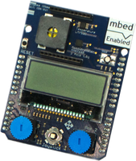

## Introduction

<p class="lead">
This lab requires you to build a program for the application board using
the uC/OS-II real-time operating system. uC/OS-II provides a fixed
priority preemptive scheduler and a variety of other OS services,
including timers, communication and synchronisation primitives, and memory
management.
</p>



## Exercises

1. Make sure that you are up to date with the exercises so far. When you are 
   ready to check your work, you can import the repositories and checkout the 
   solution branches. Build, run, and observe the solution programs. Study the
   code carefully to make sure that you understand it. Ask your lab tutor for
   help with anything that you don't understand.

   ```sh
   $ cd ~/kf6010
   $ mbed import https://github.com/davidkendall/blinky-mbed
   $ cd blinky-mbed
   $ git checkout P05
   ```
   and

   ```sh
   $ cd ~/kf6010
   $ mbed import https://github.com/davidkendall/blinky-mbed-tt
   $ cd blinky-mbed-tt
   $ git checkout P03
   ```

1. Now import the repository that is the starting point for your development of
   with uC/OS-II.

   ```sh
   $ cd ~/kf6010
   $ mbed import https://github.com/davidkendall/blinky-mbed-ucos-ii
   $ cd blinky-mbed-ucos-ii
   ```
   Notice that the code is organised in `src/uCOS-II` and `src/app`
   directories. You only need to modify `app/main.cpp`. The OS has
   been configured with a value of 1000 for `OS_TICKS_PER_SEC`. You
   should leave this unchanged. Initially, the application toggles the
   LED on the FRDM-K64F board from red to green every 0.5s. 

   Modify the system to a point where the red LED on the K64F board is
   toggled every 0.5 s, the red LED on the application board is turned off, and
   the green LED on the application board flashes at the same rate as the red
   LED on the K64F board, but is off when the red LED is on, and vice versa.
   You should have separate uC/OS-II tasks to handle each LED.

1. Once you have a system that flashes the LEDs, develop it
   further to the point where it implements all of the application board
   requirements from [week 3](L03.html). Structure your application so that
   there is a separate task for each device. Choose the
   delays and periods for your tasks to give the most responsive system
   that you can manage. Allocate the priorities for your tasks according to the
   rate monotonic scheduling method. You will need to add libraries to your project
   for the LCD, and the accelerometer and temperature sensors. Refer to
   the week 3 lab notes if you need a reminder of how to do this.

## Working at home

You'll need to spend about 5 or 6 hours per week, outside of scheduled
classroom time, working on the exercises and doing further reading. The most
important part of this will be the time that you spend programming. You can
configure your own computer to enable you to do any of the work that you would
normally do in the lab. If your own computer has a Linux OS installed, then you
can simply follow the instructions for installing the GNU Arm Embedded
Toolchain and pyOCD.  If you have a Windows or Mac machine, then you should
[install Virtualbox](https://www.virtualbox.org/manual/ch02.html) and create an
Ubuntu 16.04 Desktop guest OS to run on your machine. See [Using
Virtualbox](http://hesabu.net/kf4005/L01.html#using-virtualbox) for guidance.
You can then install the tools, as explained earlier.


