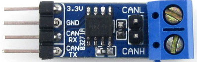

## Introduction

This lab runs for 2 weeks and covers the use of Controller Area Network (CAN)
using an API to develop both event-triggered (interrupt-driven) and
time-triggered (polling) solutions for the reception and transmission of CAN
messages.

It uses the FRDM-K64F boards and the 
[Waveshare CAN transceivers](https://www.waveshare.com/sn65hvd230-can-board.htm). 



The early exercises below use CAN in *loopback* mode and can be completed with
a single FRDM-K64F board by someone working indivdually. However, you will need
to work with a partner in the labs to complete the later exercises. In this
case, each partner should connect their FRDM-K64F to a PC, as usual. Place your
boards close enough to to each other so that you can connect them using 2
male-male jumper wires and the Waveshare CAN transceivers. You'll need a small
flat-headed screwdriver to do this. The CAN transceivers should be connected to
the FRDM-K64F boards using 4 male-female jumper wires.  You'll need to remove
the application shield from the FRDM-K64F base board in order to connect these
jumper wires. You should do this as gently as possible, ensuring that the
application board is removed evenly.  You will use `CAN0_TX` and `CAN0_RX` for
communicating using the FRDM-K64F boards. You will also need to connect 3.3V
power and ground (GND).See [FRDM-K64F
multiplexing](https://os.mbed.com/media/uploads/GregC/frdm-k64f_pinout_reve3.xls)
and [FRDM-K64F](https://os.mbed.com/platforms/FRDM-K64F/) for the pinouts.

## Using a simple CAN library and API

1. You should begin by working individually with a simple loopback example
   that uses a time-triggered architecture and polls the CAN port for 
   message reception.

     ```sh
     $ mbed import https://github.com/davidkendall/EngineMonitor
     $ cd EngineMonitor
     $ mbed compile -t GCC_ARM -m K64F -f
     ```
   Open a terminal window on your PC and start a `minicom` session, so that
   your board can communicate with your PC. Set the minicom parameters to
   `115200 8N1`. Now run the program. You should see some output in
   your `minicom` terminal indicating that CAN messages are being transmitted.
   If not, ask your lab tutor for help.

   This program transmits messages on the CAN port and receives them on the
   same CAN port, using a loopback mechanism. The loopback feature of the CAN
   port is useful for debugging in the early stages of program development.
   The data sent in this case is a simple TX count (count of the number of
   messages that have been transmitted) that is displayed when the message is
   received.

1. When your are happy that the program is working as expected, study the code
   in `src/main.cpp` and `src/can.h` and make sure that you understand the
   effects of calling each of the CAN functions (there's no need to look
   at `src/can.c`).

1. Now consider another simple loopback example. This time the program is
   built as an event-triggered system, receiving CAN messages via an interrupt
   handler.

     ```sh
     $ mbed import https://github.com/davidkendall/Display
     $ cd Display
     $ mbed compile -t GCC_ARM -m K64F -f
     ```
   As before, open a terminal window and establish a `minicom` session. Run
   the program. You should observe the same behaviour as with the first
   program. Study the code in `src/main.cpp` and make sure that you understand
   all aspects of the program. Ask your lab tutor for help if anything is
   not clear.

1. Work with a partner and connect two `FRDM-K64F` boards together via
   their CAN ports, using the CAN transceivers, as described in the introduction.

1. Modify both programs so that they both send and receive messages 
   with loopback mode turned off. Ensure that both programs are
   transmitting at 125000 baud. You'll need to study the header file `can.h` 
   to see how to do this. You'll also need to consider the message identifiers
   used by the programs. Why is this important?

1. Build, download and run the programs, having ensured that each of your PCs
   has an active `minicom` session. You should see the counts
   incrementing in the terminal windows of each machine.

1. Currently, the task that receives messages in the `Display` program runs at
   10~Hz and checks a boolean variable `rxDone` to see if a message has been
   received. The `rxDone` variable is set in the interrupt handler
   `canHandler`. It would be better if the receiving task were controlled by a
   semaphore. It should pend on the semaphore at the top of its loop. The
   semaphore should be posted by `canhandler` when a message arrives. 

   Modify the `Display` program so that message reception is handled in
   this way. Download and run your program. Check that it
   is behaving as you think it should.

1. Modify the `Display` program so that it only sends a message when `SW2` is
   pressed. It should still display messages received from the `EngineMonitor`
   program. Modify the `EngineMonitor` program so that it only sends a message
   when it receives a message from the `Display` program.

   Download and run your programs. Check that they
   are behaving as you think they should.

1. Using the interval timer functions that you worked with in [Lab
   09](L09.html), measure the time that it takes from the sending of a message
   by the `Display` program to the receiving of a response from the
   `EngineMonitor` program. Display the time taken on the `minicom` terminal.

   Can you deduce anything about the transmission rate of the CAN network
   from this result? What factors do you need to consider? 

1. Modify the data rate of the CAN bus so that it runs at maximum speed
   (1~Mbps). Repeat the measurement of the message response time. Is it clear
   that the response time has been affected by the change in the data rate?  If
   not, why not?

1. Read the [assignment specification]({{site.baseurl}}{{site.raurl}}/assgn.pdf) 
   carefully. Make progres with the work for the distributed real-time system 
   section.

